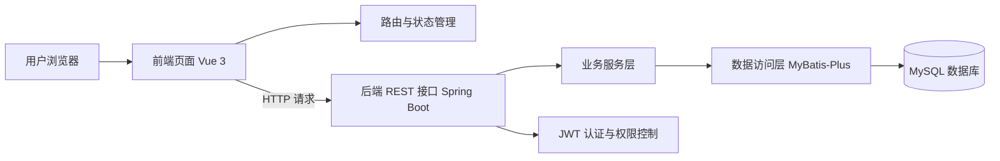

# 第四章 系统设计

在完成需求分析之后，需要进一步对系统的总体结构、功能模块、数据库、接口和权限控制进行设计。本章结合社区志愿者服务管理系统的核心业务场景，说明系统如何从架构、模块、数据和安全四个层面进行组织，为后续实现提供明确依据。

## 4.1 系统总体架构设计

本文采用前后端分离架构实现社区志愿者服务管理系统。前端负责页面展示、用户交互和路由控制，后端负责核心业务逻辑处理、权限校验和数据持久化，数据库负责保存业务数据。这种架构边界清晰、职责分离明确，可大幅提升系统的研发效率与后期维护的可扩展性。

系统总体架构可概括为三层：

1. 表现层：基于 Vue 3、Vite、TypeScript 和 Element Plus 构建，负责登录页、后台布局页、列表页、表单页和统计页的展示。
2. 业务层：基于 Spring Boot 3 构建，负责登录认证、权限校验、志愿者管理、活动管理、报名审核、签到和统计汇总等业务逻辑。
3. 数据层：基于 MySQL 构建，负责用户、角色、志愿者档案、活动、报名、签到和服务记录等数据存储。

系统中，前端通过 Axios 访问后端 REST 接口，后端通过 MyBatis-Plus 操作数据库。登录后，JWT 令牌会随请求头传递给后端，后端通过过滤器识别当前登录用户，并根据角色判断访问权限。

该架构的优点在于：

1. 前后端职责清晰，便于并行开发。
2. 接口边界明确，便于团队前后端联调与标准化验收。
3. 数据结构和页面展示分离，便于后续业务规模扩大与功能扩展。
4. 高度契合管理类系统的常规业务范式，能够有效降低研发与长期运维的边际成本。

## 4.2 系统功能模块设计

结合需求分析和实际实现，系统功能模块可以划分为以下几个部分。

### 4.2.1 登录认证模块

登录认证模块是系统入口，负责用户身份识别、token 签发和当前用户信息获取。用户登录成功后，系统返回 token 和基础用户信息；前端保存会话后可访问受保护页面。退出功能主要由前端清理本地会话完成。

### 4.2.2 志愿者管理模块

志愿者管理模块用于管理员维护志愿者档案，支持列表查询、详情查看、新增、修改和删除。该模块依赖志愿者档案表，主要用于为后续报名和签到提供基础数据。

### 4.2.3 志愿活动管理模块

活动管理模块负责活动的创建、编辑、发布、删除和查询。管理员创建活动后，可在草稿状态下继续修改；发布后，活动对志愿者可见，志愿者可执行报名和签到。

### 4.2.4 报名审核模块

报名审核模块围绕活动报名流程展开。志愿者对已发布活动发起报名后，管理员在报名列表中查看报名记录，并执行通过或拒绝操作。该模块负责控制报名状态流转，防止重复报名和非法报名。

### 4.2.5 签到与服务记录模块

签到模块用于记录志愿者在活动现场的到场情况。志愿者签到成功后，系统自动生成签到记录和服务记录，用于后续统计服务时长。管理员可查看某活动的签到列表，了解活动执行情况。

### 4.2.6 统计模块

统计模块主要面向管理员，展示志愿者数量、活动数量、报名数量和累计服务时长等基础指标。该模块属于对业务结果的集中展示，便于管理员快速了解系统运行情况。

## 4.3 数据库设计

系统数据库围绕核心业务闭环设计，采用少表、清晰、易实现的原则。当前核心表包括用户表、角色表、用户角色关联表、志愿者档案表、志愿活动表、活动报名表、活动签到表和服务记录表。

### 4.3.1 用户表 `user`

用户表用于保存系统登录用户的基础信息，包括用户名、密码哈希、真实姓名、手机号和账号状态等。该表只保存身份信息，不直接保存具体角色信息。

主要字段如下：

- `id`：主键
- `username`：用户名
- `password_hash`：密码哈希
- `real_name`：真实姓名
- `phone`：手机号
- `status`：账号状态
- `create_time`、`update_time`：时间字段

### 4.3.2 角色表 `role`

角色表用于保存系统角色类型，当前主要包括管理员和志愿者两类角色。角色表通过 `role_code` 区分具体角色，用于后续权限判断。

### 4.3.3 用户角色关联表 `user_role`

用户角色关联表用于建立用户和角色之间的关联关系。当前系统可以按单角色使用，但保留关联表后更符合关系型数据库设计习惯，也便于后续扩展多角色场景。

### 4.3.4 志愿者档案表 `volunteer_profile`

志愿者档案表用于保存志愿者业务信息，主要包括学号或工号、性别、年龄、所属社区、技能标签和备注。该表与用户表一对一关联，是报名和签到功能的基础数据来源。

### 4.3.5 志愿活动表 `activity`

志愿活动表用于保存活动信息，包括标题、内容、地点、开始时间、结束时间、招募人数、状态和创建者。活动状态当前采用简化设计，分为草稿、已发布和已结束三种。

### 4.3.6 活动报名表 `activity_signup`

活动报名表用于记录志愿者对活动的报名申请和审核结果。表中保存活动 ID、志愿者 ID、申请时间、审核状态、审核时间和审核备注。系统通过活动 ID 与志愿者 ID 的联合唯一约束，避免重复报名。

### 4.3.7 活动签到表 `activity_checkin`

活动签到表用于记录志愿者签到信息，包括签到时间、签到状态和签到备注。该表同样通过活动 ID 与志愿者 ID 的联合唯一约束避免重复签到。

### 4.3.8 服务记录表 `service_record`

服务记录表用于保存志愿服务时长统计结果，记录活动、志愿者、服务时长和来源信息。该表用于仪表盘统计和后续的服务记录查询。

### 4.3.9 数据关系说明

各表之间的关系如下：

- `user` 与 `role` 通过 `user_role` 关联。
- `user` 与 `volunteer_profile` 为一对一关系。
- `activity` 与 `activity_signup` 为一对多关系。
- `activity` 与 `activity_checkin` 为一对多关系。
- `activity` 与 `service_record` 为一对多关系。

这种设计能保证身份信息、业务档案和业务过程数据分层存储，便于实现清晰的权限控制和统计汇总。

## 4.4 接口设计

接口设计遵循 REST 风格，围绕认证、志愿者、活动、报名审核、签到和统计六类核心业务展开。所有接口统一采用 `code`、`message`、`data` 的返回格式，便于前端统一处理。

### 4.4.1 认证接口

认证接口包括登录、退出和获取当前用户信息三个核心接口。登录接口用于生成 token，当前用户信息接口用于前端恢复会话和显示用户名、真实姓名等信息。修改密码接口作为预留扩展项，并未纳入当前核心闭环。

### 4.4.2 志愿者管理接口

志愿者管理接口包括列表查询、详情查询、新增、修改和删除。此类接口均面向管理员开放，用于维护志愿者档案。

### 4.4.3 志愿活动接口

志愿活动接口包括活动列表、详情、新增、修改、删除和发布。活动列表和详情可供登录用户查看，而活动新增、修改、删除和发布仅管理员可执行。

### 4.4.4 报名审核接口

报名审核接口包括志愿者报名、报名列表查询、审核通过和审核拒绝。报名接口面向志愿者开放，审核接口面向管理员开放。

### 4.4.5 签到与统计接口

签到与统计接口包括活动签到、服务记录查询和统计概览。签到接口面向志愿者，服务记录和统计接口面向管理员。

### 4.4.6 接口设计原则

接口设计遵循以下原则：

1. 路径命名简洁直观。
2. 接口职责单一，避免一个接口承担过多业务。
3. 返回结构统一，便于前端处理。
4. 接口围绕核心闭环设计，不引入无关功能。

## 4.5 权限与安全设计

系统采用 JWT 与 Spring Security 组合实现基本鉴权，并通过方法级权限注解完成接口访问控制。

### 4.5.1 身份认证设计

用户登录成功后，后端生成 JWT 令牌，并在令牌中携带用户 ID、用户名、真实姓名和角色信息。前端在后续请求中携带该令牌，后端通过过滤器解析令牌并恢复用户身份。

### 4.5.2 权限控制设计

系统当前主要定义管理员和志愿者两类角色。管理员可访问志愿者管理、活动管理、报名审核和统计接口；志愿者可访问活动浏览、报名和签到接口。后端通过 `@PreAuthorize` 对接口访问范围进行控制，防止越权操作。

### 4.5.3 无状态会话设计

系统并未采用传统的基于服务端的 Session 方案，而是选择基于 JWT 的无状态认证机制。该设计不仅降低了服务端会话状态维护的内存与同步开销，还有效规避了分布环境下的跨域与会话共享问题，极大地提升了前后端分离架构下接口调用的弹性与灵活性。

### 4.5.4 安全边界与演进说明

当前系统已通过 JWT 实现基础的请求拦截与角色鉴权机制，充分支持了 MVP 版本的核心流转需求。虽受限于首期研发周期的评估边界，暂未实现完整的 Token 黑名单拦截与无感刷新机制（退出登录目前主要依赖前端剥离本地态），但该无状态架构为系统后续引入 Redis 全局管控等增强级安全策略预留了平滑升级的扩展空间。

## 4.6 本章小结

本章从总体架构、功能模块拆解、数据库建模、规范接口设计以及安全控制边界五个维度对系统进行了系统性设计规划。平台以成熟的前后端分离架构为骨架，通过解耦 UI 渲染与业务逻辑处理提升运维灵活性；数据库围绕高频核心业务范式进行轻便建模；接口全面遵循 RESTful 风格，并通过 JWT 与 Spring Security 强化了系统的访问级安全。这些设计方案不仅保证了系统具有清晰的层次结构与高可拓展性，同时也为第五章的代码级工程实现提供了严谨的落地规范依据。
